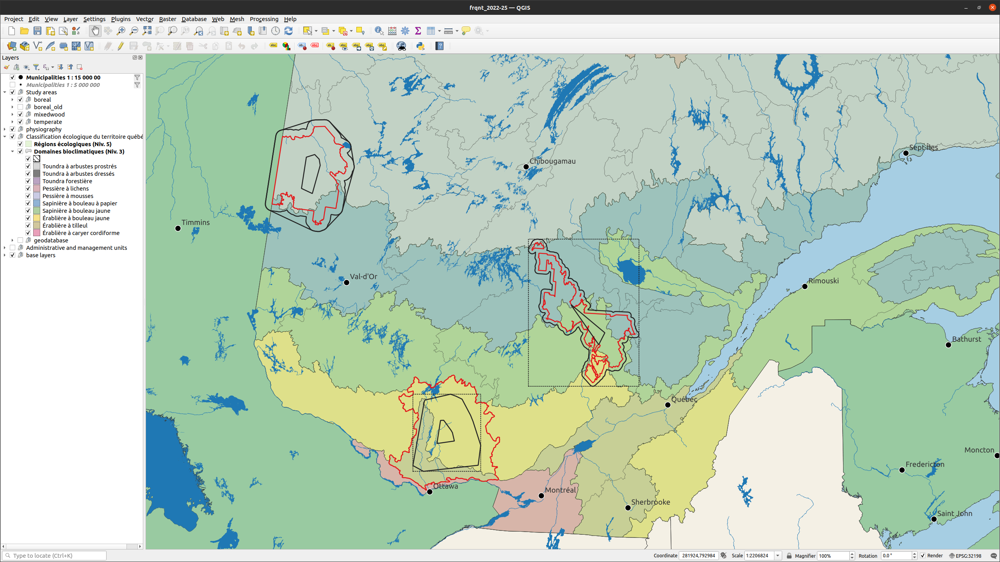

### Context

This folder contain geomatic data related to our ongoing project on the impacts of forest management on carbon dynamics along a biogeographic gradient in Quebec.

### Study areas

The study areas cover three vegetation zones, i.e. the deciduous temperate forest, the mixedwoods and the boreal forest. The exact study areas and their associated simulation areas, which are subject to change, are illustrated below.

* **Study areas**: In red - The area where variables of interest will be tracked.
* **Simulation areas**: In black, solid lines, larger areas - A larger area where the forest will be simulated. It includes a buffer around the study area to avoid various types of edge effects (isolated islands, disturbance spatial patterns, tree population migration, etc.). Here, I basically added a 10-km buffer around the study areas, and then computed a convex hull of that shape, which generate a more regular (convex) shape. That last part is probably not essential, but had the effect of increasing the buffer around the narrower portions of the study areas, e.g. the mixedwood one, and there is something I found more esthetically pleasing about the convex shapes as compared to the ones with the 10-km buffer. Some additional notes:
  + A 10-km buffer is not very wide, and one could argue that the study area could be influenced by tree populations or spatial dynamics beyond that after a few decades, but I doubt it will be very influential on the carbon dynamics, unless we design an experiment that specifically target population migration (excluding assisted migration, which does not require neighboring populations).
  + We'll see how to we'll deal with study areas that touch or are located near the province's boundaries, i.e. the temperate and boreal study areas, depending on how Yan and Jesus will generate initial communities, among other things.
 * **Testing areas** (black solid lines, smaller areas): Because I'm still not sure how a normal laptop will be able to cope with those rather large study areas (and especially with the outputs - ForCS outputs are considerably larger than regular Biomass Succession ones) I also created smaller simulation areas that I suggest you could use for testing purposes. I could create even smaller ones if size remains an issue. (<100kha would probably be best). The idea being that you'll be able to quickly run simulations on whatever computer is available to you, also improving the turnover of result compilation and analyses, only to deploy larger simulation experiments on powerful computers when they're ready.   
Here's a summary of the areas.
area (ha)

Vegetation zone  | Description of study area | Study area | Simulation area | Testing area
------------- | ------------- | ------------- | ------------- | -------------
Boreal  | Ecologication region 5a (Quebec)  | 2678106 ha  | 4081498 ha  | 384910 ha
Mixedwoods  | Management unit 042-51 | 817867 ha   | 2196308 ha  | 205385 ha
Temperate  | Ecologication region2a-3b (Quebec) | 1798432 ha   | 2899990 ha  | 337794 ha

-----------  

-----------

Updated on `r format(Sys.time(), "%b %d %Y")`

